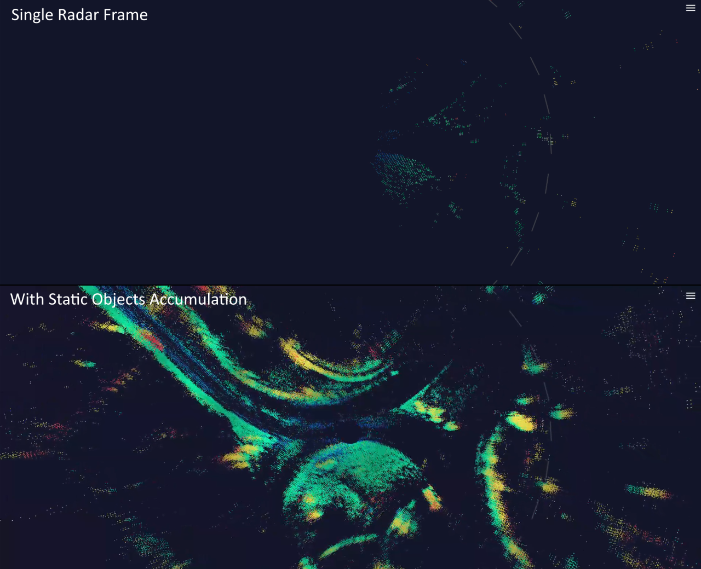

# provizio_radar_api_core

- [provizio\_radar\_api\_core](#provizio_radar_api_core)
  - [How-To](#how-to)
    - [Building and Linking](#building-and-linking)
    - [Initialization](#initialization)
    - [Connection](#connection)
    - [Receiving Point Clouds](#receiving-point-clouds)
      - [Live UDP](#live-udp)
      - [Replay or Custom Transport](#replay-or-custom-transport)
    - [Point Clouds Accumulation](#point-clouds-accumulation)
      - [Example of Point Clouds Accumulation](#example-of-point-clouds-accumulation)
      - [Accumulation Initialization](#accumulation-initialization)
      - [Storing Localization Information in provizio\_enu\_fix](#storing-localization-information-in-provizio_enu_fix)
      - [Accumulating Point Clouds](#accumulating-point-clouds)
      - [Accumulation Filters](#accumulation-filters)
      - [Retrieving Accumulated Points](#retrieving-accumulated-points)
      - [Hardware-Accelerated Transformation](#hardware-accelerated-transformation)
    - [Changing Radar Ranges](#changing-radar-ranges)
    - [Shutting Down](#shutting-down)
  - [UDP Protocol](#udp-protocol)
    - [Radar Point Clouds](#radar-point-clouds)
    - [Radar Ranges](#radar-ranges)

The official C library providing API for communicating with Provizio radars.

- Open-source as Apache License 2.0 (see [LICENSE](LICENSE))
- Written in C (supports C99+, can also be used in C++ and other client languages)​
- Supports Linux, macOS, Windows; x64/x86/ARM
- Built with CMake 3.10+
- No external dependencies (unit tests that can be disabled have open-source dependencies under compatible licenses, automatically resolved during build from Provizio forks when enabled)​
- No dynamic allocations internally, uses client-preallocated objects (can use stack, heap, custom allocation)​
- No threads created internally but supports single-threaded and multi-threaded use​
- Provides built-in UDP interfacing, but also allows for integrating any custom transport or replays​
- MISRA-compatible​
- Complete unit-tests coverage (validated in CI)​

## How-To

### Building and Linking

**provizio_radar_api_core** is a static C Library built with CMake 3.1.0+.
There is a number of options to use it in your project. Some of the options:

1. For [CMake](https://cmake.org/)-based C/C++ projects, you may use `ExternalProject_Add`, f.e.

    ```CMake
    # Include support for ExternalProject_Add
    include(ExternalProject)

    set(PROVIZIO_RADAR_CORE_API_BINARY_DIR "${CMAKE_CURRENT_BINARY_DIR}/provizio_radar_api_core_build")
    set(PROVIZIO_RADAR_CORE_API_SOURCE_DIR "${CMAKE_CURRENT_BINARY_DIR}/provizio_radar_api_core")
    set(PROVIZIO_RADAR_CORE_API_PREFIX "${CMAKE_CURRENT_BINARY_DIR}")
    set(PROVIZIO_RADAR_CORE_API_GITHUB_PROJECT "provizio/provizio_radar_api_core") # Or your own fork
    set(PROVIZIO_RADAR_CORE_API_GITHUB_BRANCH "master") # Or a specific tag you'd like to use
    set(PROVIZIO_RADAR_CORE_API_INSTALL_DIR "${PROVIZIO_RADAR_CORE_API_BINARY_DIR}/install")
    ExternalProject_Add(libprovizio_radar_api_core
        GIT_REPOSITORY "https://github.com/${PROVIZIO_RADAR_CORE_API_GITHUB_PROJECT}.git" # or "git@github.com:${PROVIZIO_RADAR_CORE_API_GITHUB_PROJECT}.git" for ssh access, or your custom repo
        GIT_TAG "${PROVIZIO_RADAR_CORE_API_GITHUB_BRANCH}"
        PREFIX "${PROVIZIO_RADAR_CORE_API_PREFIX}"
        SOURCE_DIR "${PROVIZIO_RADAR_CORE_API_SOURCE_DIR}"
        BINARY_DIR "${PROVIZIO_RADAR_CORE_API_BINARY_DIR}"
        CMAKE_ARGS "-DCMAKE_BUILD_TYPE=${CMAKE_BUILD_TYPE}" "-DCMAKE_INSTALL_PREFIX=${PROVIZIO_RADAR_CORE_API_INSTALL_DIR}" "-DENABLE_CHECK_FORMAT=OFF" "-DBUILD_TESTING=OFF"
    )
    add_dependencies(<your cmake target name> libprovizio_radar_api_core)
    target_include_directories(<your cmake target name> SYSTEM PUBLIC "${PROVIZIO_RADAR_CORE_API_INSTALL_DIR}/include")
    if ("${CMAKE_VERSION}" VERSION_GREATER_EQUAL "3.13.0")
        target_link_directories(<your cmake target name> PUBLIC "${PROVIZIO_RADAR_CORE_API_INSTALL_DIR}/lib")
    else ()
        link_directories("${PROVIZIO_RADAR_CORE_API_INSTALL_DIR}/lib")
    endif ("${CMAKE_VERSION}" VERSION_GREATER_EQUAL "3.13.0")
    target_link_libraries(<your cmake target name> provizio_radar_api_core)
    ```

2. Another option for C/C++ CMake-based projects is `add_subdirectory`. **provizio_radar_api_core** can be copied as a folder / made a git submodule of your repo. Then it's accessible as

    ```CMake
    add_subdirectory(<relative path to provizio_radar_api_core>)
    target_link_libraries(<your cmake target name> provizio_radar_api_core)
    ```

3. **provizio_radar_api_core** can be built and installed in standard system paths and then used / linked directly. F.e.:

    ```Bash
    cd /tmp
    git clone --branch master --depth 1 https://github.com/provizio/provizio_radar_api_core.git # Or your own fork and a specific version tag
    mkdir -p provizio_radar_api_core/build
    cd provizio_radar_api_core/build
    cmake .. -DCMAKE_BUILD_TYPE=Release -DENABLE_CHECK_FORMAT=OFF -DBUILD_TESTING=OFF
    cmake --build .
    sudo cmake --install .
    ```

4. **provizio_radar_api_core** can be built and installed to a temporary folder during your project's build. F.e. in a `Makefile`:

    ```Make
    PROVIZIO_RADAR_API_CORE_REPO := https://github.com/provizio/provizio_radar_api_core.git # Or your own fork
    PROVIZIO_RADAR_API_CORE_BRANCH := master # Or a specific version tag
    PROVIZIO_RADAR_API_CORE_BUILD_TYPE := Release # Or Debug
    PROVIZIO_RADAR_API_CORE_SRC := ./build/provizio_radar_api_core
    PROVIZIO_RADAR_API_CORE_BUILD := $(PROVIZIO_RADAR_API_CORE_SRC)/build
    PROVIZIO_RADAR_API_CORE_INSTALL := $(PROVIZIO_RADAR_API_CORE_BUILD)/install

    $(PROVIZIO_RADAR_API_CORE_INSTALL)/lib/libprovizio_radar_api_core.a:
        mkdir -p build
        if [ ! -d "$(PROVIZIO_RADAR_API_CORE_SRC)/include/provizio" ]; then rm -rf $(PROVIZIO_RADAR_API_CORE_SRC) && cd build && git clone --depth 1 --branch $(PROVIZIO_RADAR_API_CORE_BRANCH) $(PROVIZIO_RADAR_API_CORE_REPO); fi
        mkdir -p $(PROVIZIO_RADAR_API_CORE_BUILD)
        cd $(PROVIZIO_RADAR_API_CORE_BUILD) && cmake .. -DCMAKE_INSTALL_PREFIX=install -DCMAKE_BUILD_TYPE=$(PROVIZIO_RADAR_API_CORE_BUILD_TYPE) -DENABLE_CHECK_FORMAT=OFF -DBUILD_TESTING=OFF
        cd $(PROVIZIO_RADAR_API_CORE_BUILD) && cmake --build .
        cd $(PROVIZIO_RADAR_API_CORE_BUILD) && cmake --build . --target install --config $(PROVIZIO_RADAR_API_CORE_BUILD_TYPE)

    <your Makefile target>: $(PROVIZIO_RADAR_API_CORE_INSTALL)/lib/libprovizio_radar_api_core.a <any other dependencies>
        ...
    ```

### Initialization

1. Include the core header

    ```C
    #include "provizio/radar_api/core.h"
    ```

2. Optionally, set your custom warning and error handlers (otherwise printing to `stderr` will be used by default)

    ```C
    // Somewhere in a header

    void your_warning_handler(const char *warning);
    void your_error_handler(const char *error);

    // In a C/C++ function

    /**
    * @brief Specifies a custom function to be called on warning
    *
    * @param warning_function Function pointer or NULL (resets to default)
    * @warning Not thread safe, so it's recommended to call prior to starting any threads
    * @note By default printing to stderr is used on warning.
    */
    provizio_set_on_warning(&your_warning_handler);

    /**
    * @brief Specifies a custom function to be called on error
    *
    * @param warning_function Function pointer or NULL (resets to default)
    * @warning Not thread safe, so it's recommended to call prior to starting any threads
    * @note By default printing to stderr is used on error.
    */
    provizio_set_on_error(&your_error_handler);
    ```

3. For live UDP use, initialize sockets system once per process run

    ```C
    /**
    * @brief Enables sockets operations - to be called once prior to any other API calls
    *
    * @return 0 if successfull, non-zero error code otherwise
    * @note Required in Windows, unless WSAStartup is called somewhere else, can be omitted in other platforms
    */
    int32_t status = provizio_sockets_initialize();
    ```

4. Create and initialize a `provizio_radar_point_cloud_api_context` or an array of a few.
    The contexts are used to receive and assemble radar point clouds.
    You'll need at least as many of them as there are radars configured to use same UDP port in the network.
    The size of a single `provizio_radar_point_cloud_api_context` exceeds 2Mb, so you may prefer to place them in heap unless your app is built with a large stack size.

    ```C
    // Somewhere in a header

    // Your point cloud handling callback - see Receiving Point Clouds for more details
    void your_radar_point_cloud_callback(const provizio_radar_point_cloud *point_cloud,
                                         provizio_radar_point_cloud_api_context *context);

    // In a C/C++ function

    void* your_callback_data = <your optional callback data, may be NULL>;

    provizio_radar_point_cloud_api_context api_context;  // Large object, may cause stack overflow depending on your stack size

    /**
    * @brief Initializes a provizio_radar_point_cloud_api_context object to handle a single radar
    *
    * @param callback Function to be called on receiving a complete or partial radar point cloud
    * @param user_data Custom argument to be passed to the callback, may be NULL
    * @param context The provizio_radar_point_cloud_api_context object to initialize
    *
    * @warning radar_position_id of all packets handled by this context must be same
    */
    provizio_radar_point_cloud_api_context_init(&your_radar_point_cloud_callback, your_callback_data, &api_context);
    ```

    or

    ```C
    // Somewhere in a header

    // Your point cloud handling callback - see Receiving Point Clouds for more details
    void your_radar_point_cloud_callback(const provizio_radar_point_cloud *point_cloud,
                                         provizio_radar_point_cloud_api_context *context);

    // In a C/C++ function

    const uint16_t num_contexts = <your max number of radars on the same UDP port>;
    void* your_callback_data = <your optional callback data, may be NULL>;

    provizio_radar_point_cloud_api_context *api_contexts =
        (provizio_radar_point_cloud_api_context *)malloc(sizeof(provizio_radar_point_cloud_api_context) * num_contexts);

    /**
    * @brief Initializes multiple provizio_radar_point_cloud_api_context objects to handle packets from multiple radars
    *
    * @param callback Function to be called on receiving a complete or partial radar point cloud
    * @param user_data Custom argument to be passed to the callback, may be NULL
    * @param contexts Array of num_contexts of provizio_radar_point_cloud_api_context objects to initialize
    * @param num_contexts Number of contexts (i.e. max numbers of radars to handle) to initialize
    */
    provizio_radar_point_cloud_api_contexts_init(&your_radar_point_cloud_callback, your_callback_data, api_contexts, num_contexts);
    ```

### Connection

When the API is used in live UDP mode, [initialization](#initialization) is followed by connection.

- Single radar on a UDP port use case:

    ```C
    const uint16_t udp_port = PROVIZIO__RADAR_API_DEFAULT_PORT;
    const uint64_t receive_timeout_ns = 5000000000ULL; // 0.5 sec here, use 0 to never time out
    const uint8_t check_connection = 0; // Specify any non-zero value to wait for a valid packet during the connection

    /**
     * @brief A single Provizio Radar API connection handle on a single UDP port
     */
    provizio_radar_api_connection connection;

    /**
     * @brief Connect to the Provizio radar to start receiving packets by UDP (single radar on a UDP port)
     *
     * @param udp_port UDP port to receive from, by default = PROVIZIO__RADAR_API_DEFAULT_PORT
     * @param receive_timeout_ns Max number of nanoseconds provizio_radar_api_receive_packet should wait for a
     * packet, or 0 to wait as long as required
     * @param check_connection Use any non-zero value if the connection is to be checked to be receiving anything prior to
     * returning a successful result
     * @param radar_point_cloud_api_context Initialized provizio_radar_point_cloud_api_context to handle point cloud packets
     * (may be NULL to skip any point cloud packets)
     * @param out_connection A provizio_radar_api_connection to store the connection handle
     * @return 0 if received successfully, PROVIZIO_E_TIMEOUT if timed out, other error value if failed for another reason
     *
     * @note The connection has to be eventually closed with provizio_close_radar_connection
     */
    int32_t status = provizio_open_radar_connection(udp_port, receive_timeout_ns, check_connection, &api_context, &connection);
    ```

- Multiple radars on the same UDP port use case:

    ```C
    const uint16_t udp_port = PROVIZIO__RADAR_API_DEFAULT_PORT;
    const uint64_t receive_timeout_ns = 5000000000ULL; // 0.5 sec here, use 0 to never time out
    const uint8_t check_connection = 0; // Specify any non-zero value to wait for a valid packet during the connection

    /**
     * @brief A single Provizio Radar API connection handle on a single UDP port
     */
    provizio_radar_api_connection connection;

    /**
    * @brief Connect to the radar API to start receiving packets by UDP (multiple radars on the same UDP port)
    *
    * @param udp_port UDP port to receive from, by default = PROVIZIO__RADAR_API_DEFAULT_PORT
    * @param receive_timeout_ns Max number of nanoseconds provizio_radar_api_receive_packet should wait for a
    * packet, or 0 to wait as long as required
    * @param check_connection Use any non-zero value if the connection is to be checked to be receiving anything prior to
    * returning a successful result
    * @param radar_point_cloud_api_contexts Array of initialized provizio_radar_point_cloud_api_context to handle point
    * cloud packets (may be NULL to skip any point cloud packets)
    * @param num_radar_point_cloud_api_contexts Number of radar_point_cloud_api_contexts, i.e. max numbers of radars to
    * handle (may be 0 to skip any point cloud packets)
    * @param out_connection A provizio_radar_api_connection to store the connection handle
    * @return 0 if received successfully, PROVIZIO_E_TIMEOUT if timed out, other error value if failed for another reason
    *
    * @note The connection has to be eventually closed with provizio_close_radars_connection
    */
    int32_t status = provizio_open_radars_connection(udp_port, receive_timeout_ns, check_connection, api_contexts, num_contexts, &connection);
    ```

### Receiving Point Clouds

The Radar API supports missing and reordered packets, as seen with UDP. As a result be aware that the point clouds
callback may sometimes receive incomplete point clouds.
The callback is guaranteed to be called with ever increasing values of `frame_index` (i.e. it never receives an older
point cloud after a newer one). The only potential case when `frame_index` can drop is resetting on exceeding
`4294967295` (i.e. over 4 billion) frames. But even then `timestamp` values can only grow.

```C
void your_radar_point_cloud_callback(const provizio_radar_point_cloud *point_cloud,
                                     provizio_radar_point_cloud_api_context *context)
{
    // Radar position: either one of predefined values such as provizio_radar_position_front_center or a custom configured id
    const provizio_radar_position radar_position_id = (provizio_radar_position)context->radar_position_id;

    // As specified when initializing the context
    my_custom_user_data_type *user_data = (my_custom_user_data_type *)context->user_data;

    // 0-based radar frame index
    const uint32_t frame_index = point_cloud->frame_index;

    // Time of the frame capture measured in absolute number of nanoseconds since the start of the GPS Epoch (midnight on Jan 6, 1980)
    const uint64_t timestamp = point_cloud->timestamp;

    // Either one of provizio_radar_position enum values or a custom position id
    const uint16_t radar_position_id = point_cloud->radar_position_id;

    // Number of points in the entire frame
    const uint16_t num_points_expected = point_cloud->num_points_expected;

    // Number of points in the frame received so far
    const uint16_t num_points_received = point_cloud->num_points_received;

    // Radar range (short / medium / long / ultra-long / hyper-long) used to capture the point cloud
    const provizio_radar_range radar_range = (provizio_radar_range)point_cloud->radar_range;

    if (num_points_received < num_points_expected)
    {
        // Received an incomplete point cloud due to some missing packets
    }
    else
    {
        // A complete point cloud received

        assert(num_points_received == num_points_expected);  // num_points_received may never exceed num_points_expected
    }

    for (uint16_t i = 0; i < num_points_received; ++i)
    {
        const float x_meters = point_cloud->radar_points[i].x_meters;         // Forward, radar relative
        const float y_meters = point_cloud->radar_points[i].y_meters;         // Left, radar relative
        const float z_meters = point_cloud->radar_points[i].z_meters;         // Up, radar relative
        const float velocity_m_s = point_cloud->radar_points[i].velocity_m_s; // Forward, radar relative
        const float signal_to_noise_ratio = point_cloud->radar_points[i].signal_to_noise_ratio;

        // Do whatever you like with the point
    }
}
```

#### Live UDP

Once connected, you can start receiving UDP protocol packets:

```C
/**
 * @brief Receive and handle the next UDP packet using a previously connected API
 *
 * @param connection A previously connected provizio_radar_api_connection
 * @return 0 if received successfully, PROVIZIO_E_TIMEOUT if timed out, PROVIZIO_E_SKIPPED if received but skipped,
 * other error value if failed for another reason
 */
int32_t status = provizio_radar_api_receive_packet(&connection);
```

This call may invoke `your_radar_point_cloud_callback` up to
`PROVIZIO__RADAR_POINT_CLOUD_API_CONTEXT_IMPL_POINT_CLOUDS_BEING_RECEIVED_COUNT` times (2 by default) serially.

#### Replay or Custom Transport

You may want to handle a radar protocol packet that has been received in some other way (f.e. read from a recording
file or delivered over some custom transport implementation).

There are a few options for this:

- Single-radar, known packet type use case:

    ```C
    const provizio_radar_point_cloud_packet *packet = your_packet;
    const size_t packet_size = your_packet_size;

    /**
    * @brief Handles a single radar point cloud UDP packet from a single radar
    *
    * @param context Previously initialized provizio_radar_point_cloud_api_context
    * @param packet Valid provizio_radar_point_cloud_packet
    * @param packet_size The size of the packet, to check data is valid and avoid out-of-bounds access
    * @return 0 in case the packet was handled successfully, PROVIZIO_E_SKIPPED in case the packet was skipped as obsolete,
    * other error code in case of another error
    *
    * @warning radar_position_id of all packets handled by this context must be same (returns an error otherwise)
    */
    int32_t status = provizio_handle_radar_point_cloud_packet(&context, packet, packet_size);
    ```

- Multiple-radars, known packet type use case:

    ```C
    const provizio_radar_point_cloud_packet *packet = your_packet;
    const size_t packet_size = your_packet_size;

    /**
    * @brief Handles a single radar point cloud UDP packet from one of multiple radars
    *
    * @param contexts Previously initialized array of num_contexts of provizio_radar_point_cloud_api_context objects
    * @param num_contexts Number of contexts (i.e. max numbers of radars to handle)
    * @param packet Valid provizio_radar_point_cloud_packet
    * @param packet_size The size of the packet, to check data is valid and avoid out-of-bounds access
    * @return 0 in case the packet was handled successfully, PROVIZIO_E_SKIPPED in case the packet was skipped as obsolete,
    * PROVIZIO_E_OUT_OF_CONTEXTS in case num_contexts is not enough, other error code in case of another error
    */
    int32_t status = provizio_handle_radars_point_cloud_packet(contexts, num_contexts, packet, packet_size);
    ```

- Single-radar, unknown packet type use case:

    ```C
    const void *payload = your_payload;
    const size_t payload_size = your_payload_size;

    /**
    * @brief Handles a single Provizio Radar API UDP packet from a single radar, that can be a correct
    * provizio_radar_point_cloud_packet or something else
    *
    * @param context Previously initialized provizio_radar_point_cloud_api_context
    * @param payload The payload of the UDP packet
    * @param payload_size The size of the payload in bytes
    * @return 0 if it's a provizio_radar_point_cloud_packet and it was handled successfully, PROVIZIO_E_SKIPPED if it's not
    * a provizio_radar_point_cloud_packet, other error code if it's a provizio_radar_point_cloud_packet but its handling
    * failed for another reason
    *
    * @warning if it's a provizio_radar_point_cloud_packet, radar_position_id of all packets handled by this context must
    * be same (returns an error otherwise)
    */
    int32_t status = provizio_handle_possible_radar_point_cloud_packet(&context, payload, payload_size);
    ```

- Multiple-radars, unknown packet type use case:

    ```C
    const void *payload = your_payload;
    const size_t payload_size = your_payload_size;

    /**
    * @brief Handles a single Provizio Radar API UDP packet from one of multiple radars, that can be a correct
    * provizio_radar_point_cloud_packet or something else
    *
    * @param contexts Previously initialized array of num_contexts of provizio_radar_point_cloud_api_context objects
    * @param num_contexts Number of contexts (i.e. max numbers of radars to handle)
    * @param payload The payload of the UDP packet
    * @param payload_size The size of the payload in bytes
    * @return 0 if it's a provizio_radar_point_cloud_packet and it was handled successfully, PROVIZIO_E_SKIPPED if it's not
    * a provizio_radar_point_cloud_packet, PROVIZIO_E_OUT_OF_CONTEXTS in case num_contexts is not enough, other error code
    * if it's a provizio_radar_point_cloud_packet but its handling failed for another reason
    */
    int32_t status = provizio_handle_possible_radars_point_cloud_packet(contexts, num_contexts, payload, payload_size);
    ```

Either of these calls may invoke `your_radar_point_cloud_callback` up to
`PROVIZIO__RADAR_POINT_CLOUD_API_CONTEXT_IMPL_POINT_CLOUDS_BEING_RECEIVED_COUNT` times (2 by default) serially.

### Point Clouds Accumulation

Point clouds accumulation keeps some of reflected points (normally ones from static objects) "visible" for a number of
frames after they were originally received. It makes point clouds much denser and features of objects much clearer -
similar to long exposure of dark scenes in photography.
Accumulation requires 2 inputs: point clouds and relative localization. When radar-based localization is used, it
effectively turns into a SLAM (Simultaneous Localization and Mapping) solution.
With Provizio Radar API you first receive point clouds and then separately accumulate them if needed.

#### Example of Point Clouds Accumulation



#### Accumulation Initialization

1. Include the accumulation header

    ```C
    #include "provizio/radar_api/src/radar_points_accumulation.c"
    ```

2. Create a buffer of `provizio_accumulated_radar_point_cloud`.

   ```C
   enum
   {
       num_accumulated_point_clouds = 100  // Enables storing up to 100 radar frames
   };

   // Not recommended to allocate on stack like below unless your app is built with a large stack size as
   // provizio_accumulated_radar_point_cloud is large
   provizio_accumulated_radar_point_cloud stack_accumulated_point_clouds[num_accumulated_point_clouds];

   // or

   // Safer to allocate on heap if permitted for your app, but has to be freed when finished
   provizio_accumulated_radar_point_cloud *heap_accumulated_point_clouds =
       (provizio_accumulated_radar_point_cloud *)malloc(num_accumulated_point_clouds *
           sizeof(provizio_accumulated_radar_point_cloud));
   ```

   The size of the array you choose defines how many point clouds can be accumulated in it. When full, adding a new
   point cloud drops the oldest accumulated cloud. The more precise your localization is, the more it makes sense to
   accumulate - starting from about 10-20 point clouds in case of lower precision, to 200 or more in case of high
   precision localization.

3. Initialize the buffer.

   ```C
   /**
    * @brief Initializes an array of provizio_accumulated_radar_point_cloud to be later used for point clouds accumulation
    * as a circular buffer.
    *
    * @param accumulated_point_clouds Pointer to the array of provizio_accumulated_radar_point_cloud to initialize.
    * @param num_accumulated_point_clouds Number of provizio_accumulated_radar_point_cloud in the array.
    * @see provizio_accumulate_radar_point_cloud
    */
   provizio_accumulated_radar_point_clouds_init(accumulated_point_clouds, (size_t)num_accumulated_point_clouds);
   ```

#### Storing Localization Information in provizio_enu_fix

`provizio_enu_fix` objects are used to store localization information (i.e. position and orientation) of radars for
accumulation purposes.
When localization uses some sort of GNSS, such as GPS or RTK, it needs to be first converted to a [local ENU
coordinate system](https://en.wikipedia.org/wiki/Local_tangent_plane_coordinates), and then adjusted using the radar's
extrinsics to get the ENU position and orientation of the radar rather than the ego vehicle.

```C
/**
 * @brief Represents an orientation and position.
 *
 * @see provizio_quaternion
 * @see provizio_enu_position
 */
provizio_enu_fix radar_fix;

// 1. Set radar_fix.orientation, i.e. a provizio_quaternion which is a unit quaternion storing a spatial orientation of
//    the radar. Identity quaternion stands for east-looking orientation.
/**
 * @brief Sets the specified quaternion from the specified Euler angles, as applied in this order: z, y, x (yaw, pitch,
 * roll).
 *
 * @param x_rad Rotation around the forward (roll) or east axis, depending on the context (radians).
 * @param y_rad Rotation around the left (pitch) or north axis, depending on the context (radians).
 * @param z_rad Rotation around the up (yaw) axis (radians).
 * @param out_quaternion The rotation/orientation quaternion to be set.
 * @see https://en.wikipedia.org/wiki/Euler_angles
 * @see provizio_quaternion
 * @see provizio_quaternion_set_identity
 */
provizio_quaternion_set_euler_angles(float_x_rad, float_y_rad, float_z_rad, &radar_fix.orientation);


// 2. Set radar_fix.position, i.e. a provizio_enu_position which is a position of the radar as right-handed cartesian
//    coordinates (East, North, Up) in meters, relative to whatever reference point - normally on Earth's surface.
//    See https://en.wikipedia.org/wiki/Local_tangent_plane_coordinates.
radar_fix.position.east_meters = float_east_meters;
radar_fix.position.north_meters = float_north_meters;
radar_fix.position.up_meters = float_up_meters;
```

#### Accumulating Point Clouds

On receiving every `provizio_radar_point_cloud` accumulate it in your `provizio_accumulated_radar_point_cloud`s buffer.

```C
provizio_radar_point_cloud *point_cloud = received_point_cloud; // F.e. in your provizio_radar_point_cloud_callback

provizio_accumulated_radar_point_cloud_iterator iterator; // More details below

/**
 * @brief Pushes a new radar point cloud to the array of provizio_accumulated_radar_point_cloud (used as a circular
 * buffer). It enables tracking historical radar points as they would be seen later by the same radar if it could still
 * see them. If accumulated_point_clouds buffer is full then the oldest accumulated point cloud gets dropped.
 *
 * @param point_cloud The new radar point cloud to be accumulated.
 * @param fix_when_received A provizio_enu_fix of the radar at the moment of the point cloud capture. Being the fix of
 * the radar, not the ego vehicle, it has to be pre-transformed to respect the position and orientation of the radar
 * relative to the reference frame of the localization system (extrinsics). All accumulated point clouds in
 * accumulated_point_clouds buffer must use the same ENU reference point. Accumulation can be reset using
 * provizio_accumulated_radar_point_clouds_init in case a new reference point is required (in long journeys).
 * @param accumulated_point_clouds An array of provizio_accumulated_radar_point_cloud previously initialized with
 * provizio_accumulated_radar_point_clouds_init to store accumulated points clouds as a circular buffer.
 * @param num_accumulated_point_clouds Number of provizio_accumulated_radar_point_cloud in accumulated_point_clouds.
 * @param filter Function that defines which points are to be accumulated and which ones to be dropped. May be NULL to
 * accumulate all, &provizio_radar_points_accumulation_filter_static to accumulate static points, or a custom filter.
 * @param filter_user_data Specifies user_data argument value of the filter (may be NULL).
 * @return provizio_accumulated_radar_point_cloud_iterator pointing to the just pushed point cloud. It can be used to
 * iterate over point clouds accumulated so far - from newest to oldest.
 * @see provizio_accumulate_radar_point_cloud_static
 * @see provizio_radar_point_cloud
 * @see provizio_enu_fix
 * @see provizio_accumulated_radar_point_cloud
 * @see provizio_accumulated_radar_point_cloud_iterator
 * @see provizio_accumulated_radar_point_clouds_init
 * @see provizio_radar_points_accumulation_filter
 * @see provizio_radar_points_accumulation_filter_static
 */
iterator = provizio_accumulate_radar_point_cloud(point_cloud, &radar_fix, accumulated_point_clouds,
    num_accumulated_point_clouds, filter, filter_user_data);

// or

/**
 * @brief A shortcut for provizio_accumulate_radar_point_cloud using provizio_radar_points_accumulation_filter_static.
 * @param point_cloud The new radar point cloud to be accumulated.
 * @param fix_when_received provizio_enu_fix of the radar at the moment of the point cloud capture. Being the fix of the
 * radar, not the ego vehicle, it has to be pre-transformed to respect the position and orientation of the radar
 * relative to the reference frame of the localization system (extrinsics). All accumulated point clouds in
 * accumulated_point_clouds buffer must use the same ENU reference point. Accumulation can be reset using
 * provizio_accumulated_radar_point_clouds_init in case a new reference point is required (in long journeys).
 * @param accumulated_point_clouds An array of provizio_accumulated_radar_point_cloud previously initialized with
 * provizio_accumulated_radar_point_clouds_init to store accumulated points clouds as a circular buffer.
 * @param num_accumulated_point_clouds Number of provizio_accumulated_radar_point_cloud in accumulated_point_clouds.
 * @return provizio_accumulated_radar_point_cloud_iterator pointing to the just pushed point cloud. It can be used to
 * iterate over point clouds accumulated so far - from newest to oldest.
 *
 * @see provizio_accumulate_radar_point_cloud
 * @see provizio_radar_points_accumulation_filter_static
 */
iterator = provizio_accumulate_radar_point_cloud_static(point_cloud, &radar_fix, accumulated_point_clouds,
    num_accumulated_point_clouds);
```

#### Accumulation Filters

Optional accumulation filter can be used when calling `provizio_accumulate_radar_point_cloud`. It makes it accumulate
only some of the points (most often, static points as with `provizio_radar_points_accumulation_filter_static` and
`provizio_accumulate_radar_point_cloud_static`).

There are predefined filters:

```C
/**
 * @brief A provizio_radar_points_accumulation_filter that accumulates all points, i.e. no doesn't filter.
 *
 * @param in_points - Input (unfiltered) array of points.
 * @param num_in_points - Number of points in in_points.
 * @param accumulated_point_clouds - Ignored by this filter.
 * @param num_accumulated_point_clouds - Ignored by this filter.
 * @param new_iterator - Ignored by this filter.
 * @param user_data - Ignored by this filter, use NULL.
 * @param out_points Output (filtered) array of points, to be assigned by the filter, at least num_in_points large.
 * @param num_out_points Pointer to the output (filtered) number of points, to be set by the filter (can't exceed
 * PROVIZIO__MAX_RADAR_POINTS_IN_POINT_CLOUD).
 * @see provizio_enu_fix
 * @see provizio_accumulate_radar_point_cloud
 * @see provizio_radar_points_accumulation_filter
 */
void provizio_radar_points_accumulation_filter_copy_all(
    const provizio_radar_point *in_points, uint16_t num_in_points,
    provizio_accumulated_radar_point_cloud *accumulated_point_clouds, size_t num_accumulated_point_clouds,
    const provizio_accumulated_radar_point_cloud_iterator *new_iterator, void *user_data,
    provizio_radar_point *out_points, uint16_t *num_out_points);

/**
 * @brief A provizio_radar_points_accumulation_filter that accumulates only static (non-moving) points, as defined from
 * their radial velocities relative to the radar and the radar's own movement as detected by GNSS fixes history.
 *
 * @param in_points - Input (unfiltered) array of points.
 * @param num_in_points - Number of points in in_points.
 * @param accumulated_point_clouds An array of provizio_accumulated_radar_point_cloud previously initialized with
 * provizio_accumulated_radar_point_clouds_init to store accumulated points clouds as a circular buffer.
 * @param num_accumulated_point_clouds Number of provizio_accumulated_radar_point_cloud in accumulated_point_clouds.
 * @param new_iterator Iterator to the point cloud being accumulated.
 * @param user_data Ignored by this filter, use NULL.
 * @param out_points Output (filtered) array of points, to be assigned by the filter, at least num_in_points large.
 * @param num_out_points Pointer to the output (filtered) number of points, to be set by the filter (can't exceed
 * PROVIZIO__MAX_RADAR_POINTS_IN_POINT_CLOUD).
 * @see provizio_enu_fix
 * @see provizio_accumulate_radar_point_cloud
 * @see provizio_radar_points_accumulation_filter
 */
void provizio_radar_points_accumulation_filter_static(
    const provizio_radar_point *in_points, uint16_t num_in_points,
    provizio_accumulated_radar_point_cloud *accumulated_point_clouds, size_t num_accumulated_point_clouds,
    const provizio_accumulated_radar_point_cloud_iterator *new_iterator, void *user_data,
    provizio_radar_point *out_points, uint16_t *num_out_points);
```

When `NULL` is used as a value for `filter`, then `provizio_radar_points_accumulation_filter_copy_all` is used by
default.

You can define your own custom filters if required. All filters should match the appropriate function prototype:

```C
/**
 * @brief Function type to be used as a filter for point clouds, i.e. a function that defines which points are to be
 * accumulated and which ones to be dropped.
 *
 * @param in_points - Input (unfiltered) array of points.
 * @param num_in_points - Number of points in in_points.
 * @param accumulated_point_clouds An array of provizio_accumulated_radar_point_cloud previously initialized with
 * provizio_accumulated_radar_point_clouds_init to store accumulated points clouds as a circular buffer.
 * @param num_accumulated_point_clouds Number of provizio_accumulated_radar_point_cloud in accumulated_point_clouds.
 * @param new_iterator Iterator to the point cloud being accumulated.
 * @param user_data Custom argument to be passed to the filter (specified when accumulating), may be NULL.
 * @param out_points Output (filtered) array of points, to be assigned by the filter, at least num_in_points large.
 * @param num_out_points Pointer to the output (filtered) number of points, to be set by the filter (can't exceed
 * PROVIZIO__MAX_RADAR_POINTS_IN_POINT_CLOUD).
 * @see provizio_enu_fix
 * @see provizio_accumulate_radar_point_cloud
 * @see provizio_accumulated_radar_point_cloud_iterator
 */
typedef void (*provizio_radar_points_accumulation_filter)(
    const provizio_radar_point *in_points, uint16_t num_in_points,
    provizio_accumulated_radar_point_cloud *accumulated_point_clouds, size_t num_accumulated_point_clouds,
    const provizio_accumulated_radar_point_cloud_iterator *new_iterator, void *user_data,
    provizio_radar_point *out_points, uint16_t *num_out_points);
```

#### Retrieving Accumulated Points

Now you can retrive the point clouds (and their appropriate points) accumulated in your
`provizio_accumulated_radar_point_cloud`s buffer.

1. Iterate over accumulated point clouds and points using the `iterator` returned from
   `provizio_accumulate_radar_point_cloud`/`provizio_accumulate_radar_point_cloud_static`.

   ```C
   // Iterate over all accumulated point clouds, newest to oldest
   for (; !provizio_accumulated_radar_point_cloud_iterator_is_end(&iterator, accumulated_point_clouds,
                                                                  num_accumulated_point_clouds);
        provizio_accumulated_radar_point_cloud_iterator_next_point_cloud(&iterator, accumulated_point_clouds,
                                                                         num_accumulated_point_clouds))
   {
       // Get and use the accumulated point cloud
   }
   ```

    ```C
   // Iterate over all accumulated points, newest to oldest
   for (; !provizio_accumulated_radar_point_cloud_iterator_is_end(&iterator, accumulated_point_clouds,
                                                                  num_accumulated_point_clouds);
        provizio_accumulated_radar_point_cloud_iterator_next_point(&iterator, accumulated_point_clouds,
                                                                   num_accumulated_point_clouds))
   {
       // Get and use the accumulated point
   }
   ```

   You can also find out how many point clouds and points are accumulated in the buffer:

   ```C
       /**
       * @brief Returns a total number of points accumulated so far in all point clouds in accumulated_point_clouds buffer.
       *
       * @param accumulated_point_clouds An array of provizio_accumulated_radar_point_cloud previously initialized with
       * provizio_accumulated_radar_point_clouds_init to store accumulated points clouds as a circular buffer.
       * @param num_accumulated_point_clouds Number of provizio_accumulated_radar_point_cloud in accumulated_point_clouds.
       * @return Total number of points accumulated so far in all point clouds in accumulated_point_clouds buffer.
       */
       size_t points_count = provizio_accumulated_radar_points_count(accumulated_point_clouds,
           num_accumulated_point_clouds);
   ```

   ```C
       /**
       * @brief Returns a number of point clouds accumulated so far in accumulated_point_clouds buffer.
       *
       * @param accumulated_point_clouds An array of provizio_accumulated_radar_point_cloud previously initialized with
       * provizio_accumulated_radar_point_clouds_init to store accumulated points clouds as a circular buffer.
       * @param num_accumulated_point_clouds Number of provizio_accumulated_radar_point_cloud in accumulated_point_clouds.
       * @return Number of point clouds accumulated so far in accumulated_point_clouds buffer.
       */
       size_t point_clouds_count = provizio_accumulated_radar_point_clouds_count(accumulated_point_clouds,
           num_accumulated_point_clouds);
   ```

2. Get the accumulated points and their positions relative to the current position and orientation of the radar or
   another reference frame.

   Either get a point cloud and its transformation (it's more efficient than getting point-by-point as transformation
   being built is the same for the entire point cloud):

   ```C
   provizio_radar_point_cloud transformed_point_cloud; // You may prefer to allocate it on heap as it's a large object
   float transformation_matrix[16]; // More details below

   /**
   * @brief Returns an accumulated point cloud that the specified non-end iterator points to; with an option to either
   * transform its points so their positions are returned relative to the specified provizio_enu_fix of the radar, or
   * generate a 4x4 matrix that can perform such a transformation by multiplying to positions of the accumulated points.
   *
   * @param iterator A provizio_accumulated_radar_point_cloud_iterator.
   * @param current_fix A provizio_enu_fix of the radar to transform relative to, i.e. where the same radar is at now. May
   * be NULL in case both optional_out_transformed_point_cloud and optional_out_transformation_matrix are also NULL.
   * @param accumulated_point_clouds An array of provizio_accumulated_radar_point_cloud previously initialized with
   * provizio_accumulated_radar_point_clouds_init to store accumulated points clouds as a circular buffer.
   * @param num_accumulated_point_clouds Number of provizio_accumulated_radar_point_cloud in accumulated_point_clouds.
   * @param optional_out_transformed_point_cloud When non-NULL, stores transformed radar points; i.e. the points as they
   * would be "seen" by the same radar in its current position, if it could still "see" them.
   * @param optional_out_transformation_matrix When non-NULL, must point to a float array 16 floats (64 bytes) long to
   * store a 4x4 transformation matrix in column major order. Multiplying this matrix to points positions (as (x, y, z, 1)
   * 4d-vectors) transforms points from where they were relative to the radar at the moment of their capture to where they
   * would be "seen" by the same radar in its current position, if it could still "see" them.
   * @return Untransformed accumulated radar point cloud, or NULL if iterator is an end iterator.
   * @see provizio_accumulated_radar_point_cloud_iterator
   * @see provizio_enu_fix
   *
   * @note When non-NULL optional_out_transformed_point_cloud is specified, the transformation is done without any use of
   * hardware acceleration, so it can be slow. When runtime performance is important and appropriate hw capabilities are
   * present, it's recommended to use optional_out_transformation_matrix and then hw-accelerated transformation instead.
   */
   const provizio_accumulated_radar_point_cloud *untransformed_accumulated_point_cloud =
       provizio_accumulated_radar_point_cloud_iterator_get_point_cloud(
           &iterator, &current_fix, accumulated_point_clouds, num_accumulated_point_clouds, &transformed_point_cloud,
           (float *)transformation_matrix);
   ```

   ... or get a point and its transformation (for iterating point-by-point, convenient but not as efficient):

   ```C
   provizio_radar_point transformed_point;
   float transformation_matrix[16]; // More details below

   /**
    * @brief Returns an accumulated point that the specified non-end iterator points to; with an option to either transform
   * it so its position is returned relative to the specified provizio_enu_fix of the radar, or generate a 4x4 matrix that
   * can perform such a transformation by multiplying to its position.
   *
   * @param iterator A provizio_accumulated_radar_point_cloud_iterator.
   * @param current_fix A provizio_enu_fix of the radar to transform relative to, i.e. where the same radar is at now. May
   * be NULL in case both optional_out_transformed_point and optional_out_transformation_matrix are also NULL.
   * @param accumulated_point_clouds An array of provizio_accumulated_radar_point_cloud previously initialized with
   * provizio_accumulated_radar_point_clouds_init to store accumulated points clouds as a circular buffer.
   * @param num_accumulated_point_clouds Number of provizio_accumulated_radar_point_cloud in accumulated_point_clouds.
   * @param optional_out_transformed_point When non-NULL, stores a transformed radar point; i.e. the point as it would be
   * "seen" by the same radar in its current position, if it could still "see" this point.
   * @param optional_out_transformation_matrix When non-NULL, must point to a float array 16 floats (64 bytes) long to
   * store a 4x4 transformation matrix in column major order. Multiplying this matrix to a point position (as (x, y, z, 1)
   * 4d-vector) transforms the point from where it was relative to the radar at the moment of its capture to where it
   * would be "seen" by the same radar in its current position, if it could still "see" this point.
   * @return Untransformed accumulated radar point, or NULL if iterator is an end iterator.
   * @see provizio_accumulated_radar_point_cloud_iterator_get_point_cloud
   * @see provizio_accumulated_radar_point_cloud_iterator
   * @see provizio_enu_fix
   *
   * @note When non-NULL optional_out_transformed_point is specified, the transformation is done without any use of
   * hardware acceleration, so it can be slow. When runtime performance is important and appropriate hw capabilities are
   * present, it's recommended to use optional_out_transformation_matrix and then hw-accelerated transformation instead.
   * Also, provizio_accumulated_radar_point_cloud_iterator_get_point_cloud is recommended instead, so
   * optional_out_transformation_matrix doesn't have to be generated separately for every point as it's same for the
   * entire accumulated point cloud.
   */
   const provizio_radar_point *untransformed_point =
       provizio_accumulated_radar_point_cloud_iterator_get_point(
           &iterator, &current_fix, accumulated_point_clouds, num_accumulated_point_clouds, &transformed_point,
           (float *)transformation_matrix);
   ```

#### Hardware-Accelerated Transformation

   Both `provizio_accumulated_radar_point_cloud_iterator_get_point_cloud` and
   `provizio_accumulated_radar_point_cloud_iterator_get_point` provide 2 options for transforming positions of
   accumulated points relative to the current position and orientation of the radar or another reference frame.

   1. Specifying non-`NULL` value for `optional_out_transformed_point_cloud` / `optional_out_transformed_point` argument
      performes unaccelerated transformation on CPU. It can be a slow operation in case of accumulating a lot of large
      point clouds. In the same time it's the simplest option and it doesn't require any special H/W capabilities.
   2. Specifying non-`NULL` value for `optional_out_transformation_matrix` argument doesn't perform any transformation,
      but instead generates a 4x4 matrix that performs such a transformation when multiplied to point positions in the
      form of `(x, y, z, 1)` 4d-vectors. When GPU or other h/w acceleration of vector-to-matrix multiplication is
      present, it's significantly more efficient to transform lots of large accumulated point clouds.

### Changing Radar Ranges

Provizio radars can operate in various range modes, such as short, medium, long, ultra long and hyper long ranges.
Current radar ranges are specified in `provizio_radar_point_cloud`, you can change them using `provizio_set_radar_range`:

```C
/**
 * @brief Makes a radar (or all radars) change a range
 *
 * @param radar_position_id Either one of provizio_radar_position enum values or a custom position id. Can also be
 * provizio_radar_position_any to set for all radars
 * @param range Target range to set
 * @param udp_port UDP port to send change range message, by default = PROVIZIO__RADAR_API_SET_RANGE_DEFAULT_PORT
 * (if 0)
 * @param ipv4_address IP address to send change range message, in the standard IPv4 dotted decimal notation. By default
 * = "255.255.255.255" - broadcast (if NULL)
 * @return 0 if received successfully, PROVIZIO_E_TIMEOUT if timed out, other error value if failed for another reason
 */
int32_t status = provizio_set_radar_range(radar_position_id, range, udp_port, ipv4_address);
```

### Shutting Down

When you finished with the API, it has to be properly shut down.

1. In case you established a `provizio_radar_api_connection`, close the connection:

    ```C
    /**
    * @brief Closes a previously connected radar API (either a single or multiple radars on the same port)
    *
    * @param connection A previously connected provizio_radar_api_connection
    * @return 0 if successfull, error code otherwise
    */
    int32_t status = provizio_close_radars_connection(&connection);
    ```

2. In case you allocated `provizio_radar_point_cloud_api_context`[s], deallocate them correctly.

3. In case you called `provizio_sockets_initialize`, deinitialize sockets correctly:

    ```C
    /**
    * @brief Terminates sockets operations - to be called once after all the other API calls
    *
    * @return 0 if successfull, non-zero error code otherwise
    * @note Required in Windows, unless WSACleanup is called somewhere else, can be omitted in other platforms
    */
    int32_t status = provizio_sockets_deinitialize();
    ```

## UDP Protocol

The Provizio radars UDP protocol:

- Binary packets up to 1472 bytes long​
- Can tolerate lost packets​
- Point Clouds: up to 65535 points per point cloud, up to 60 points per UDP packet​
- Supports single or multiple radars, on the same or different ports​
- Permits identifying radars by position ids to allow for replacing radars easily​

### Radar Point Clouds

Radar point clouds are published as broadcast UDP packets, default UDP port number: 7769.
Point clouds are sent as multiple packets per frame (i.e. single read that can be assumed instantaneous).
Each packet has a size of 1472 bytes or less, depending on a number of points it contains.

Each packet has the following structure (all fields use network bytes order when applicable, no padding):

| Field                                                 | Size (bytes)                         | Data Type | Description                                                                                                                     |
| ----------------------------------------------------- | ------------------------------------ | --------- | ------------------------------------------------------------------------------------------------------------------------------- |
| packet_type                                           | 2                                    | uint16_t  | Always = 1, can't change even on protocol updates                                                                               |
| protocol_version                                      | 2                                    | uint16_t  | Currently = 2, to be incremented on any protocol changes (used for backward compatibility)                                      |
| frame_index                                           | 4                                    | uint32_t  | 0-based frame index (resets back to 0 if ever exceeds 4294967295)                                                               |
| timestamp                                             | 8                                    | uint64_t  | Time of the frame capture measured in absolute number of nanoseconds since the start of the GPS Epoch (midnight on Jan 6, 1980) |
| radar_position_id                                     | 2                                    | uint16_t  | Either one of provizio_radar_position enum values or a custom position id                                                       |
| total_points_in_frame                                 | 2                                    | uint16_t  | Total number of points in the frame #frame_index, never exceeds 65535                                                           |
| num_points_in_packet                                  | 2                                    | uint16_t  | Number of points in the current packet, never exceeds (1472 - 24) / 24                                                          |
| radar_range                                           | 2                                    | uint16_t  | Radar range, one of provizio_radar_range enum values                                                                            |
| point_0: x_meters                                     | 4                                    | float     | Radar-relative X (forward) position of the point in meters                                                                      |
| point_0: y_meters                                     | 4                                    | float     | Radar-relative Y (left) position of the point in meters                                                                         |
| point_0: z_meters                                     | 4                                    | float     | Radar-relative Z (up) position of the point in meters                                                                           |
| point_0: radar_relative_radial velocity_m_s           | 4                                    | float     | Radar-relative radial velocity of the point in meters per second                                                                |
| point_0: signal_to_noise_ratio                        | 4                                    | float     | Signal-to-noise ratio (unitless)                                                                                                |
| point_0: ground_relative_radial velocity_m_s          | 4                                    | float     | Ground-relative radial velocity of the point in meters per second                                                               |
| point_1: ...                                          |                                      |           |                                                                                                                                 |
| ...                                                   |                                      |           |                                                                                                                                 |
| **Total**                                             | **24 + (24 * num_points_in_packet)** |           | Never exceeds 1472 bytes                                                                                                        |

### Radar Ranges

Setting radar ranges is done via sending UDP packets to an appropriate port of a radar (or all radars in the local
network), default UDP port number: 7770. The radar sends back an acknowledgement packet.

Set range packet:

| Field                          | Size (bytes)                         | Data Type | Description                                                                                                                     |
| ------------------------------ | ------------------------------------ | --------- | ------------------------------------------------------------------------------------------------------------------------------- |
| packet_type                    | 2                                    | uint16_t  | Always = 2, can't change even on protocol updates                                                                               |
| protocol_version               | 2                                    | uint16_t  | Currently = 1, to be incremented on any protocol changes (used for backward compatibility)                                      |
| radar_position_id              | 2                                    | uint16_t  | Either one of provizio_radar_position enum values or a custom position id                                                       |
| radar_range                    | 2                                    | uint16_t  | One of provizio_radar_range enum values                                                                                         |
| **Total**                      | **8**                                |           |                                                                                                                                 |

Acknowledgement packet:

| Field                          | Size (bytes)                         | Data Type | Description                                                                                                                     |
| ------------------------------ | ------------------------------------ | --------- | ------------------------------------------------------------------------------------------------------------------------------- |
| packet_type                    | 2                                    | uint16_t  | Always = 3, can't change even on protocol updates                                                                               |
| protocol_version               | 2                                    | uint16_t  | Currently = 1, to be incremented on any protocol changes (used for backward compatibility)                                      |
| radar_position_id              | 2                                    | uint16_t  | Either one of provizio_radar_position enum values or a custom position id                                                       |
| requested_radar_range          | 2                                    | uint16_t  | One of provizio_radar_range enum values                                                                                         |
| error_code                     | 4                                    | int32_t   | 0 for success, PROVIZIO_E_NOT_PERMITTED if the range is not supported                                                           |
| **Total**                      | **12**                               |           |                                                                                                                                 |
